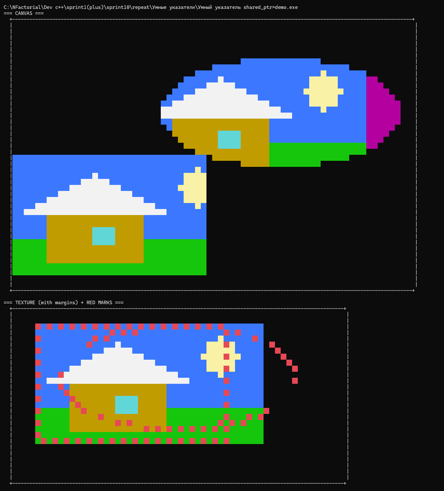

# 📘 shared_ptr lesson (Shape/Texture 1:1)

Проект — демонстрация поведения `std::shared_ptr` на примере `Shape` ↔ `Texture`:
- кто владеет объектом
- когда растёт `use_count`
- когда объект уничтожается
- почему «внутри функции» счётчик больше (передача `shared_ptr` по значению)

---

## ✅ Как запускать (Windows / g++)

> Важно: чтобы в консоли корректно показывались emoji и псевдографика — ставим UTF-8.

```bat
chcp 65001
g++ -std=c++17 -O2 -Wall -Wextra -pedantic ^
  main.cpp console_color.cpp texture.cpp shape.cpp canvas.cpp ^
  textures_factory.cpp dashed_border.cpp utf8_table.cpp lesson_print.cpp ^
  -o demo.exe

demo.exe
````

---

## ❗ Почему «в README всё рушится»

GitHub Markdown **ломает выравнивание**, если текст не в code-block.

✅ Решение: **весь вывод программы вставляй внутрь**
трёх обратных кавычек:

````
```text
...тут вывод...
````

````

Ниже я уже вставил вывод правильно — **ничего не должно ломаться**.

---

## 🧾 Полный вывод программы (1:1)

```text
Microsoft Windows [Version 10.0.26200.7623]
(c) Корпорация Майкрософт (Microsoft Corporation). Все права защищены.

C:\...\Умные указатели\Умный указатель shared_ptr\shared_ptr_lesson>chcp 65001
Active code page: 65001

C:\...\Умные указатели\Умный указатель shared_ptr\shared_ptr_lesson>g++ -std=c++17 -O2 -Wall -Wextra -pedantic ^
More?   main.cpp console_color.cpp texture.cpp shape.cpp canvas.cpp ^
More?   textures_factory.cpp dashed_border.cpp utf8_table.cpp lesson_print.cpp ^
More?   -o demo.exe

C:\...\Умные указатели\Умный указатель shared_ptr\shared_ptr_lesson>demo.exe

=========================================================================
📘 shared_ptr УРОК: Robot/Charger == Shape/Texture (1:1)
=========================================================================

=========================================================================
🧾 ЛЕГЕНДА ПИКСЕЛЕЙ ТЕКСТУР (что означает каждая буква)
=========================================================================
┌─────┬───────────────────────────────────────────────┐
│ Код │ Значение                                      │
├─────┼───────────────────────────────────────────────┤
│ B   │ 🌌 Небо (sky)                                 │
│ Y   │ ☀️  Солнце (sun)                              │
│ G   │ 🟩 Трава (grass)                              │
│ O   │ 🧱 Стены дома (walls)                         │
│ W   │ ⬛ Крыша (roof)                               │
│ C   │ 🪟 Окно (window)                              │
│ .   │ 🟣 Выход за пределы текстуры (outside texture)│
│ ' ' │ ⬜ Пусто (ничего не рисуем)                   │
│ R   │ 🔴 Красная пунктирная рамка (source-mark)     │
└─────┴───────────────────────────────────────────────┘

📌 Важно:
  • HouseSceneTexture 🌤️🏠 — это ОДНА картинка-сцена: небо(B)+солнце(Y)+дом(O/W/C)+трава(G).
  • GreenFillTexture 🟩 — это заливка символом 'G' на каждом пикселе (доказываем в коде).
🔹 ШАГ 1: Создаём фигуры (долгоживущие владельцы)
🎯 ОЖИДАЕМ: фигуры переживут внутренний блок.
--------------------------------------------------------------------------
🔷/🟣✅ Shape '🔷 Shape#1 (square)' created (this=0x3b433ff6f0)
🔷/🟣✅ Shape '🟣 Shape#2 (ellipse)' created (this=0x3b433ff740)
✅ ПОЛУЧИЛИ: фигуры созданы.
--------------------------------------------------------------------------

🔹 ШАГ 2: ВНУТРЕННИЙ БЛОК: создаём HouseScene/GreenFill/BlueUnused
🎯 ОЖИДАЕМ:
   - BlueUnusedTexture 🟦 умрёт при выходе из блока (никому не передана)
   - 🖼️ HouseSceneTexture 🌤️🏠 / GreenFillTexture 🟩 НЕ умрут, потому что их будут держать фигуры
--------------------------------------------------------------------------
🧱✅ Texture 🖼️ HouseSceneTexture 🌤️🏠 [содержит и небо, и солнце, и дом, и траву] created  (this=0x1d59a3d7dd0, size=40x20)
✅ Проверка GreenFillTexture 🟩: sample[0][0]='G' (должно быть 'G')
🧱✅ Texture GreenFillTexture 🟩 [заливка: каждый пиксель = 'G'] created  (this=0x1d59a3d7ea0, size=40x20)
🧱✅ Texture BlueUnusedTexture 🟦 [не используется, должна умереть после блока] created  (this=0x1d59a3be780, size=40x20)

📊 После make_shared (ШАГ 2)
+-------------------------------+------------------------+-------------+--------------------+
| Texture                       | Владельцы              | use_count   | Комментарий        |
+-------------------------------+------------------------+-------------+--------------------+
|  🖼️ HouseSceneTexture 🌤️🏠    | локальная houseScene   | 1           | только локальная   |
|  GreenFillTexture 🟩          | локальная greenFill    | 1           | только локальная   |
|  BlueUnusedTexture 🟦         | локальная blueUnused   | 1           | будет уничтожена   |
+-------------------------------+------------------------+-------------+--------------------+

🔹 ШАГ 3: SetTexture (как UseCharger)
🎯 ОЖИДАЕМ:
   - use_count HouseScene/GreenFill станет 2 (локальная + фигура)
   - BlueUnused останется 1
--------------------------------------------------------------------------
   [ВНУТРИ] 🔷 Shape#1 (square) tex.get()=0x1d59a3d7dd0 use_count=2 name="🖼️ HouseSceneTexture 🌤️🏠 [содержит и небо, и солнце, и дом, и траву]"
   [ВНУТРИ] 🟣 Shape#2 (ellipse) tex.get()=0x1d59a3d7ea0 use_count=2 name="GreenFillTexture 🟩 [заливка: каждый пиксель = 'G']"
📌 ПОЯСНЕНИЕ: сейчас use_count=2 потому что:
   (1) локальная переменная (houseScene/greenFill) владеет текстурой
   (2) поле Shape::texture_ внутри фигуры тоже владеет той же текстурой

📊 После SetTexture (ШАГ 3)
+-------------------------------+--------------------------+-------------+--------------------------+
| Texture                       | Владельцы                | use_count   | Комментарий              |
+-------------------------------+--------------------------+-------------+--------------------------+
|  🖼️ HouseSceneTexture 🌤️🏠    | локальная + 🔷 square    | 2           | используется квадратом   |
|  GreenFillTexture 🟩          | локальная + 🟣 ellipse   | 2           | используется овалом      |
|  BlueUnusedTexture 🟦         | локальная blueUnused     | 1           | всё ещё локальная        |
+-------------------------------+--------------------------+-------------+--------------------------+
--------------------------------------------------------------------------
---- (выходим из внутреннего блока) ----
🧱💥 Texture BlueUnusedTexture 🟦 [не используется, должна умереть после блока] destroyed  (this=0x1d59a3be780)
--------------------------------------------------------------------------
✅ ПОЛУЧИЛИ: BlueUnusedTexture 🟦 умерла (у неё был 1 владелец в блоке)

📊 После выхода из блока
+-------------------------------+--------------+-------------+---------------+
| Texture                       | Владельцы    | use_count   | Комментарий   |
+-------------------------------+--------------+-------------+---------------+
|  🖼️ HouseSceneTexture 🌤️🏠    | 🔷 square    | 1           | жива          |
|  GreenFillTexture 🟩          | 🟣 ellipse   | 1           | жива          |
|  BlueUnusedTexture 🟦         | —            | 0           | уничтожена    |
+-------------------------------+--------------+-------------+---------------+

🔹 ШАГ 5: 🟣 ellipse.SetTexture(square.GetTexture())
🎯 ОЖИДАЕМ:
   - GreenFillTexture 🟩 умрёт (если больше никто не держит)
   - 🖼️ HouseSceneTexture 🌤️🏠 станет общей у 🔷 и 🟣
--------------------------------------------------------------------------
   [ВНУТРИ] 🟣 Shape#2 (ellipse) tex.get()=0x1d59a3d7dd0 use_count=2 name="🖼️ HouseSceneTexture 🌤️🏠 [содержит и небо, и солнце, и дом, и траву]"
🧱💥 Texture GreenFillTexture 🟩 [заливка: каждый пиксель = 'G'] destroyed  (this=0x1d59a3d7ea0)
📌 ПОЯСНЕНИЕ: здесь use_count снова стал 2, потому что:
   (1) 🔷 square держит HouseSceneTexture
   (2) 🟣 ellipse теперь тоже держит HouseSceneTexture
   А GreenFillTexture 🟩 умерла, потому что у неё не осталось владельцев.

📊 После ellipse.SetTexture(square.GetTexture())
+-------------------------------+--------------------------+-------------+-----------------------+
| Texture                       | Владельцы                | use_count   | Комментарий           |
+-------------------------------+--------------------------+-------------+-----------------------+
|  🖼️ HouseSceneTexture 🌤️🏠    | 🔷 square + 🟣 ellipse   | 2           | совместное владение   |
|  GreenFillTexture 🟩          | —                        | 0           | уничтожена            |
+-------------------------------+--------------------------+-------------+-----------------------+

🔹 ШАГ 6: 🔷 square.ResetTexture()
🎯 ОЖИДАЕМ: 🖼️ HouseSceneTexture 🌤️🏠 НЕ умрёт, потому что её держит 🟣.
--------------------------------------------------------------------------
🔷 Shape#1 (square) 🧹 ResetTexture() -> reset()
   🔎
   ДО reset поле texture_: get()=0x1d59a3d7dd0  name="🖼️ HouseSceneTexture 🌤️🏠 [содержит и небо, и солнце, и дом, и траву]"  use_count=2
   🔎
   ПОСЛЕ reset поле texture_: nullptr (use_count=0)
📌 ПОЯСНЕНИЕ: после ResetTexture() у 🔷 square больше нет владения.
   HouseSceneTexture остаётся жить, потому что 🟣 ellipse всё ещё владелец (use_count=1).

📊 После square.ResetTexture()
+-------------------------------+--------------+-------------+----------------+
| Texture                       | Владельцы    | use_count   | Комментарий    |
+-------------------------------+--------------+-------------+----------------+
|  🖼️ HouseSceneTexture 🌤️🏠    | 🟣 ellipse   | 1           | всё ещё жива   |
+-------------------------------+--------------+-------------+----------------+

🔹 ШАГ 7: 🟣 ellipse.ResetTexture() (последний владелец)
🎯 ОЖИДАЕМ: 🖼️ HouseSceneTexture 🌤️🏠 умрёт здесь.
--------------------------------------------------------------------------
🟣 Shape#2 (ellipse) 🧹 ResetTexture() -> reset()
   🔎
   ДО reset поле texture_: get()=0x1d59a3d7dd0  name="🖼️ HouseSceneTexture 🌤️🏠 [содержит и небо, и солнце, и дом, и траву]"  use_count=1
🧱💥 Texture 🖼️ HouseSceneTexture 🌤️🏠 [содержит и небо, и солнце, и дом, и траву] destroyed  (this=0x1d59a3d7dd0)
   🔎
   ПОСЛЕ reset поле texture_: nullptr (use_count=0)
📌 ПОЯСНЕНИЕ: после ResetTexture() у 🟣 ellipse владельцев не осталось.
   use_count стал 0 => shared_ptr удалил объект => 💥 dtor Texture.

📊 После ellipse.ResetTexture()
+-------------------------------+-------------+-------------+---------------+
| Texture                       | Владельцы   | use_count   | Комментарий   |
+-------------------------------+-------------+-------------+---------------+
|  🖼️ HouseSceneTexture 🌤️🏠    | —           | 0           | уничтожена    |
+-------------------------------+-------------+-------------+---------------+

🧾 ЛЕГЕНДА (что означает каждая текстура):
  🖼️ HouseSceneTexture 🌤️🏠  = картинка-сцена (небо + солнце + дом + трава)
  GreenFillTexture 🟩        = зелёная заливка: символ 'G' на каждом пикселе
  BlueUnusedTexture 🟦       = синяя текстура, создана специально, чтобы умереть при выходе из блока

=========================================================================
🎨 ГРАФИКА (подтверждение) — квадрат+овал + SOURCE (красные пунктиры)
=========================================================================


📌 ВАЖНО: графика НЕ управляет временем жизни.
   Сейчас создадим отдельную текстуру 🖼️ CanvasHouseScene 🎨 и нарисуем 2 фигуры.
--------------------------------------------------------------------------
🧱✅ Texture 🖼️ CanvasHouseScene 🎨 [квадрат+овал на канвасе + source с красными пунктирами] created  (this=0x1d59a3d9370, size=40x20)
🔷/🟣✅ Shape '🔷 CANVAS-Square' created (this=0x1d59a3d7dc0)
--------------------------------------------------------------------------
🧩 CANVAS: 🔷 square.SetTexture(canvasHouse)
🎯 ОЖИДАЕМ: внутри SetTexture() use_count временно станет 2 (копия параметра)
   🔎 [до square.SetTexture] canvasHouse.get()=0x1d59a3d9370 use_count=1
--------------------------------------------------------------------------
   [ВНУТРИ] 🔷 CANVAS-Square tex.get()=0x1d59a3d9370 use_count=2 name="🖼️ CanvasHouseScene 🎨 [квадрат+овал на канвасе + source с красными пунктирами]"
--------------------------------------------------------------------------
   🔎 [после square.SetTexture] canvasHouse.get()=0x1d59a3d9370 use_count=2
✅ ПОЛУЧИЛИ: теперь владельцы = canvasHouse + 🔷 square (use_count должен быть 2)
--------------------------------------------------------------------------
🔷/🟣✅ Shape '🟣 CANVAS-Ellipse' created (this=0x1d59a3d7e40)
--------------------------------------------------------------------------
🧩 CANVAS: 🟣 ellipse.SetTexture(canvasHouse)
🎯 ОЖИДАЕМ: в строке [ВНУТРИ ФУНКЦИИ] (в SetTexture) use_count станет 3
           потому что параметр tex — КОПИЯ shared_ptr (передача по значению)
           (владельцы уже: canvasHouse + 🔷 square, плюс копия параметра)
   🔎 [до ellipse.SetTexture] canvasHouse.get()=0x1d59a3d9370 use_count=2
📌 ДО вызова (в main) use_count=2 — это нормально;
   значение 3 видно в строке [ВНУТРИ ФУНКЦИИ] внутри SetTexture()
--------------------------------------------------------------------------
   [ВНУТРИ] 🟣 CANVAS-Ellipse tex.get()=0x1d59a3d9370 use_count=3 name="🖼️ CanvasHouseScene 🎨 [квадрат+овал на канвасе + source с красными пунктирами]"
--------------------------------------------------------------------------
   🔎 [после ellipse.SetTexture] canvasHouse.get()=0x1d59a3d9370 use_count=3
✅ ПОЛУЧИЛИ: теперь владельцы = canvasHouse + 🔷 square + 🟣 ellipse (use_count должен быть 3)
--------------------------------------------------------------------------
📌 Сейчас у canvasHouse владельцев: 3 (canvasHouse + 🔷 square + 🟣 ellipse)
📌 Адрес объекта Texture (canvasHouse.get()) = 0x1d59a3d9370

=== CANVAS ===

=========================================================================
🔴 TEXTURE SOURCE (откуда взяты 🔷 прямоугольник и 🟣 овал)
=========================================================================

=== TEXTURE (with margins) + RED MARKS ===

✅ END: когда canvasHouse и фигуры канваса выйдут из области видимости -> CanvasHouseScene 🎨 уничтожится автоматически.
🔷/🟣💀 Shape '🔷 CANVAS-Square' destroyed (this=0x1d59a3d7dc0)
🔷/🟣💀 Shape '🟣 CANVAS-Ellipse' destroyed (this=0x1d59a3d7e40)
🧱💥 Texture 🖼️ CanvasHouseScene 🎨 [квадрат+овал на канвасе + source с красными пунктирами] destroyed  (this=0x1d59a3d9370)
🔷/🟣💀 Shape '🟣 Shape#2 (ellipse)' destroyed (this=0x3b433ff740)
🔷/🟣💀 Shape '🔷 Shape#1 (square)' destroyed (this=0x3b433ff6f0)

C:\...\Умные указатели\Умный указатель shared_ptr\shared_ptr_lesson>
````

---

## 🧠 Диаграммы владения (коротко)

### ШАГ 3

```
houseScene → HouseSceneTexture ← square
greenFill  → GreenFillTexture  ← ellipse
```

### ШАГ 5

```
square → HouseSceneTexture ← ellipse
(GreenFillTexture уничтожена)
```

### CANVAS

```
canvasHouse
     │
     ▼
┌──────────────────────┐
│  CanvasHouseScene 🎨 │
└──────────────────────┘
     ▲            ▲
     │            │
CANVAS-Square  CANVAS-Ellipse
```

---

## 🎨 Графика: CANVAS (скриншот)

> Если хочешь вставить картинки — сохрани скриншоты как:

* `images/canvas.png`
* `images/source.png`

И добавь:

```md
## 🎨 Графика: CANVAS


## 🔴 Texture Source (рамки)

```

